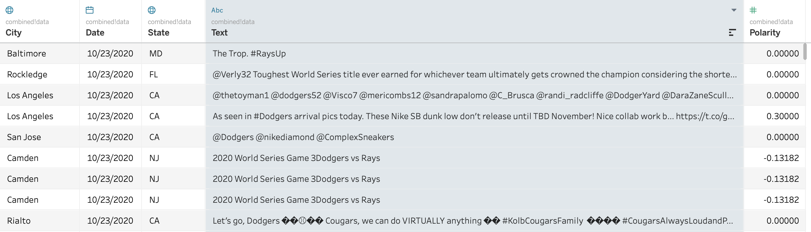
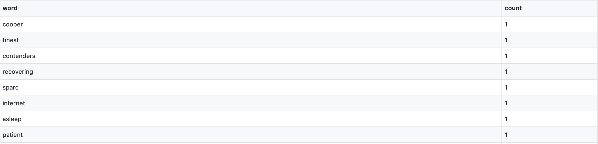
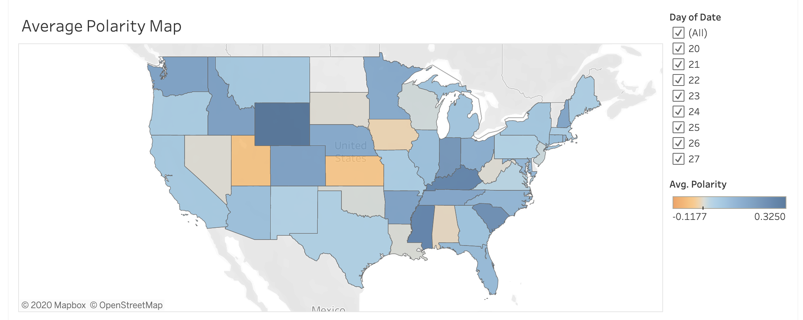
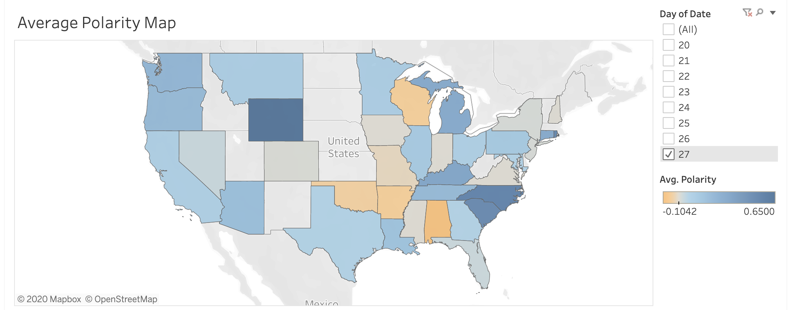
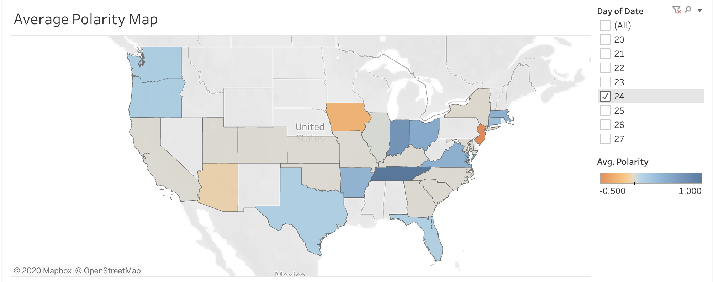
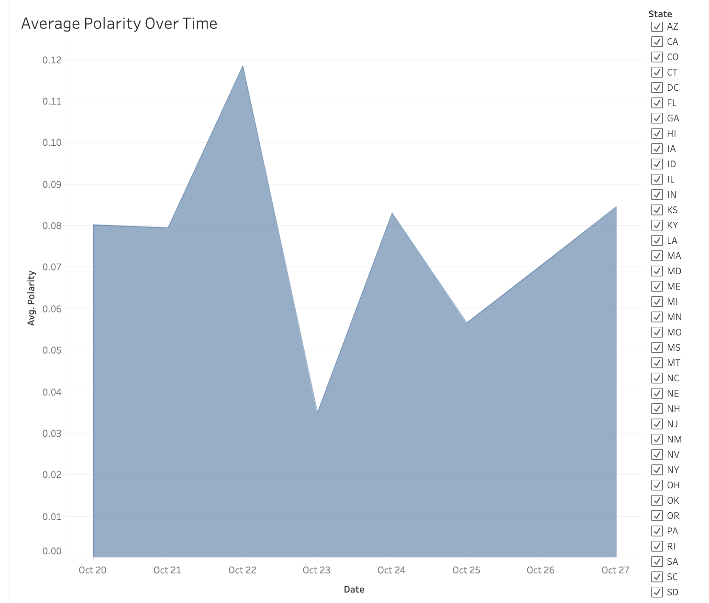
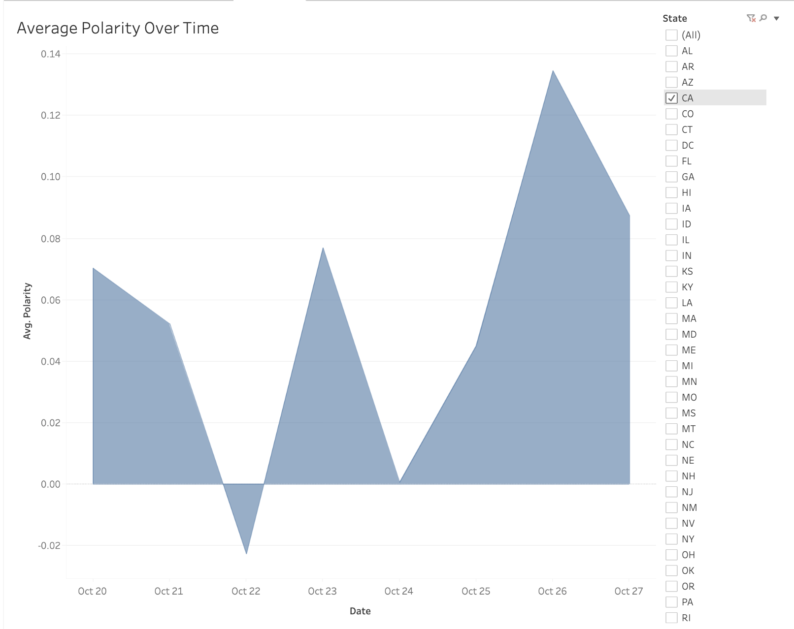
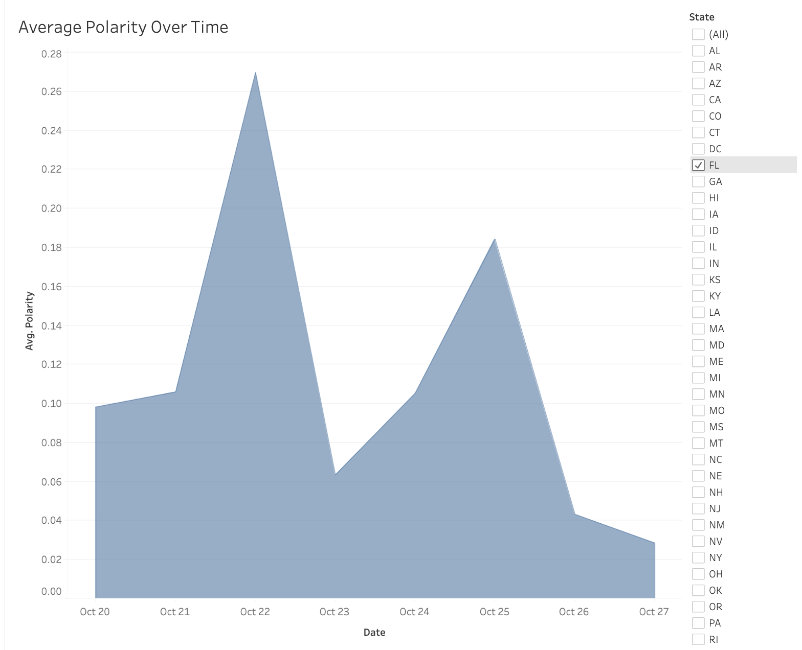
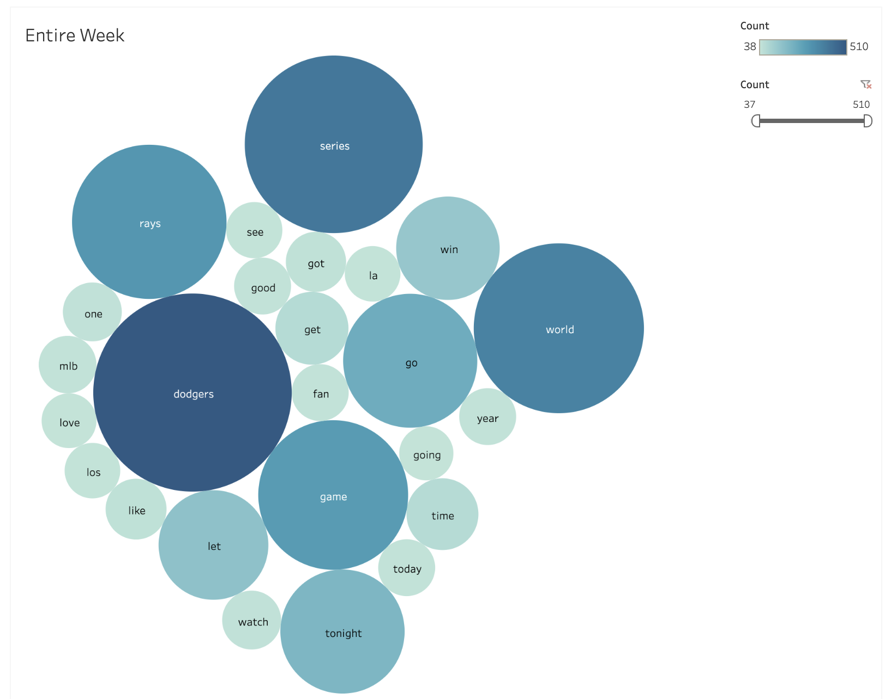

TLDR: We made a project looking at twitter sentiment during the 2020 world series. Turns out, people from Florida and California are very loyal to their respective teams. Also, game 4, where the Rays won in the final few minutes, was quite a polarizing event.

## Introduction
In every professional sport, the primary focus is the race for a championship and to earn the pinnacle trophy. While there are a myriad of professional sports organizations like the NBA (basketball), NFL (American football), or MLS (Soccer), no championship has as many eyes on it as the MLB (baseball)’s World Series, since the sport has been woven into the fabric of America’s culture. The World Series evolves far beyond a mere baseball tournament, as the best of seven game series celebrates our national pastime. Want to know what people are thinking or discussing about the World Series? One of the best ways to gauge nationwide sentiment over any trending topics is to turn to social media. Therefore, this project seeks to better understand the 2020 MLB World Series by looking at discussions or posts about it on Twitter. If you weren’t able to tune in to the World Series this year, it was played from October 20-27 by the Tampa Bay Rays and the Los Angeles Dodgers, where the Dodgers won the series 4-2 and took home The Commissioner’s Trophy. Using text analysis, we explore the polarity of tweet content as well as associated words that people use to talk about the series as it was going on. These trends are visualized and vary by state, series progression, and time. 

The project utilizes eight days worth of Twitter data, which was generously shared with us by Professor Mike Izbicki. Data is stored on a supercomputer as a series of JSON files of all publicly accessible geotagged tweets, organized by date. To get started, we gathered all tweets that were posted between October 20 and October 27 2020, since this was the time period between the start and end dates of the series, so it was trending on Twitter. Then, we generated our dataset by extracting only tweets that mention the following key words: ‘World Series’, ‘Rays’, ‘Dodgers’, and ‘MLB’. This resulted in a dataset containing 1963 tweets. For each tweet in our dataset, our data consisted of their respective date, geographic location (city, state), and we were also able to measure the sentiment of each tweet. A package called TextBlob was used to assign sentiment from a scale of -1 to 1, with -1 being negative, 0 being neutral, and 1 being positive. Below, is a sample of what the data set looks like.

For the most part, TextBlob was able to correctly identify positive or negative sentiment, but there were some caveats to this package. TextBlob is a useful tool to measure sentiment, but it does possess a few flaws, such as struggling to identify the sentiment of emojis and slang terms. For example, the tweets “Dodgers in 5 😜💙 #Dodgers #WorldSeries” and “Ji-Man Choi: A treasure. #Rays #RaysUp https://t.co/HC0MDRv076” both have positive sentiments to it, but a value of 0 was assigned to them because TextBlob was unsure about their sentiment. Therefore, we expect that there were many tweets with neutral sentiment. 

For the visualizations in the next section, we created two main data sets. The first dataset is the parsed data from twitter discussed earlier, which includes the tweet, and columns with their respective location and polarity. The second data set was prepared using the first dataset and is useful in creating a word cloud visualization in Tableau. The first step in creating the second data set was preprocessing the text for each tweet. It involved lowercasing all words (to avoid duplicate words because of letter size) and removing common English words, since they do not add significance to the understanding of data. The next step was to tokenize the text into a list of strings and add each word to a list of tuples with the word and counts of that word as they appeared. Below, is a sample of what the word count data set looks like.

Our main objective in making visualizations was to visualize trends or topics that people frequently mentioned and expressed an opinion about the World Series on social media. In addition, we wanted to visualize variations in trends based on state, series progression, and time. All visualization associated with this project were generated in Tableau and published on Tableau public. Some examples have been elaborated upon below.

## Key Visualizations

For our map visualization, our public online dashboard has an interactive feature where the user can filter the map’s display by date (between October 20-27). Additionally, the user can hover their cursor over each individual state to show the average tweet polarity in a state, given the filtered conditions. Above is a map displaying the average polarity of tweets about the World Series, across the entire the week of the World Series, as related to each state. 

Looking at the tweet polarity for each state on October 27th shown above, the final game of the World Series, there are some interesting insights we can observe. Perhaps most tellingly is the difference in polarity between Florida and California, the two states where the Rays and Dodgers are based in, respectively. CA had an average tweet polarity of about .088 while FL had an average tweet polarity of about .023. On October 27th the Dodgers won why World Series, making it very clear why the sentiment in CA was more positive than in FL on that day. Additionally, the entire west coast shared positive sentiment on the 27th, with OR and WA having an average positive sentiment value of about .2.

Average sentiment on October the 24th also tells an interesting story about the two states. It’s important to note that on October 24th the Rays won Game 4 of the World Series in one of the most dramatic games to ever occur and became an instant-classic. The average twitter sentiment on this day in CA was a meager 0.0 compared to FL’s relatively much more positive sentiment of .1, expressing CA’s discontent and FL’s joy of the events of Game 4.

Overall throughout the entire week that the World Series was played, twitter sentiment was generally positive with FL having a higher positive sentiment of about .1 and CA having a lower positive sentiment of .06.

To understand how polarity varied throughout each day of the week that the World Series occurred, we created a visualization that plots polarity as a function of time. Addtionally, we added the capability to filter tweet sentiment by state for each day. Above is an area graphic displaying tweet polarity across the United States from October 20-October 27. We know that the Tampa Bay Rays won game 2 and game 4 while the Los Angeles Dodgers won game 1, game 3, game 5, and game 6. On October 22nd, the day after the Rays won game 2, and October 24th, the day the Rays won game 4, there were significant spikes in positive sentiment. There were declines in sentiment for each games the Dodgers one, except for the final game, Game 6. This seems to suggest that, perhaps, overall, twitter users were rooting for the underdog, who in this case was the Rays.

Above: Twitter sentiment throughout the week in CA. The sentiment graphs for FL and CA are the most telling with each spike in positive sentiment correponsing to a win and each decrease in sentiment corresponding to a loss that day. These two visuals are perhaps the most telling images, directly showing how strongly loyal residents of a state are to their teams. Below: Twitter sentiment throughout the week in FL.

To understand what World Series viewers are tweeting about the most, we created an interactive word cloud visualization that formats the most frequently used words in tweets into a cloud, excluding specific words and characters that aren’t relevant (like non-alphanumeric characters and punctuation). Most frequently used words are in a bigger bubble while less frequently used words are smaller. Additionally, in the web-hosted version, the user can hover their cursor over a particular word to see the count of how many times that word was used in a tweet. We can see that words like dodgers, ryas, game, and tonight are oft tweeted words, as indicated by their larger size. These words are obviously relevant to the World Series in 2020 and show the contents of popular tweets. Interestingly, the Dodgers were more tweeted about in the Rays, showing their relatively higher popularity for Twitter users. Our previous analyses show that the higher volume of tweets could indicate either positive or negative sentiment, depending on the specific game.

## Conclusion

We were able to draw interesting conclusions through the use of interactive visuals. From the visuals, we gain a clear understanding on the geographic distribution of the tweets and how polarity varies across states. This allows us to facilitate comparisons between states as well, such as observing how California’s average sentiment was more positive than Florida, since the LA team beat Tampa Bay.  We were also able to visualize polarity as a function of time. This gave us a better understanding on people’s attitudes and how they change in response to how the series score progressed after every game. Lastly, we were able to visualize the most frequently used words over the course of the World Series. From all of this information, we can better understand how people on Twitter felt about the World Series, whether it is more negative or positive during a particular time. Ultimately, our conclusions drawn from polarity averages in each state is our most meaningful data.

An ethical consideration that we must take into account is the database of tweets that we are originally presented with. A very small number of twitter users consent to their tweets that include geographic location to be included in a publicly available dat set. Due to this limitation, and our very specific tweet filter words (only 4 words), we must critically look at the size of our data set. A full data set of almost 2,000 tweets over the course of the World Series of an immensely popular sport is unrealistic. Additionally, many people who watch the series aren’t necessarily tweeting about it, but also posting on different social media platforms or not posting at all. Ethically, we must look at the accuracy of polarity, volume, and general sentiment from the lense of analysts whose subjects are far fewer than would be ideal. The most accurate visualizations and information would come from accessing all tweets, as well as finding other common words that we could have filtered on that are about the World Series. We are nevertheless able to draw meaningful conclusions from our chosen data, but with a healthy degree of skepticism. 

Access to more seasons or more data would allow us to create even more insightful visualizations. This would require Twitter data from 2006-2020 (Twitter founded in 2006), to be available. However, visualizations would need to be separated by year, since the World Series is played by different teams, who are based in different locations, every year, so the polarity and word counts would likely vary immensely from year to year. Additionally, looking at polarity in specific cities that have an MLB team based there could lead to more specific insights between more specific locations. In our current project, we looked at tweet volume by state; however, it may be more meaningful in the future to look at tweet volume as proportional to population of the state. Data from more World Series’ would greatly increase the number and quality of conclusions we are able to draw.

Furthermore, we can try to optimize the performance of Textblob so we can increase sentiment accuracy. Recall that Textblob fails when there are emojis or slang words. Additionally, Textblob fails when words are spelled incorrectly. We can do additional data cleaning by correcting words through Textblob’s ‘correct()’ package. By doing so, we could get a better representation of public sentiment regarding the World Series per year, based on who is playing.

What are your thoughts on the turnout of the 2020 World Series? What’s next? The 2021 World Series awaits!

Link to Tableau profile:
